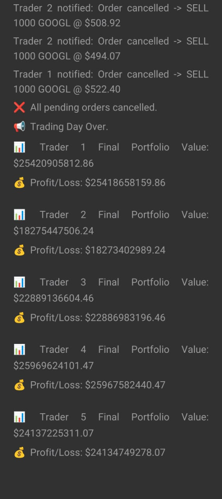

# stock-exchange-simulation
 
This is the optional project assigned to us for JPMorganChase Women in Quantitative Finance Mentorship Program 2025.

Problem statement can be found here- https://drive.google.com/file/d/1lo648MIEuI5m4u_7h_XEGiy-_-2vA1sA/view?usp=sharing

Explanation of the code can be found here - https://drive.google.com/file/d/1Avgz4yYR366np2uwiSgCHEZsGVyW_EdB/view?usp=sharing

Expected output-

